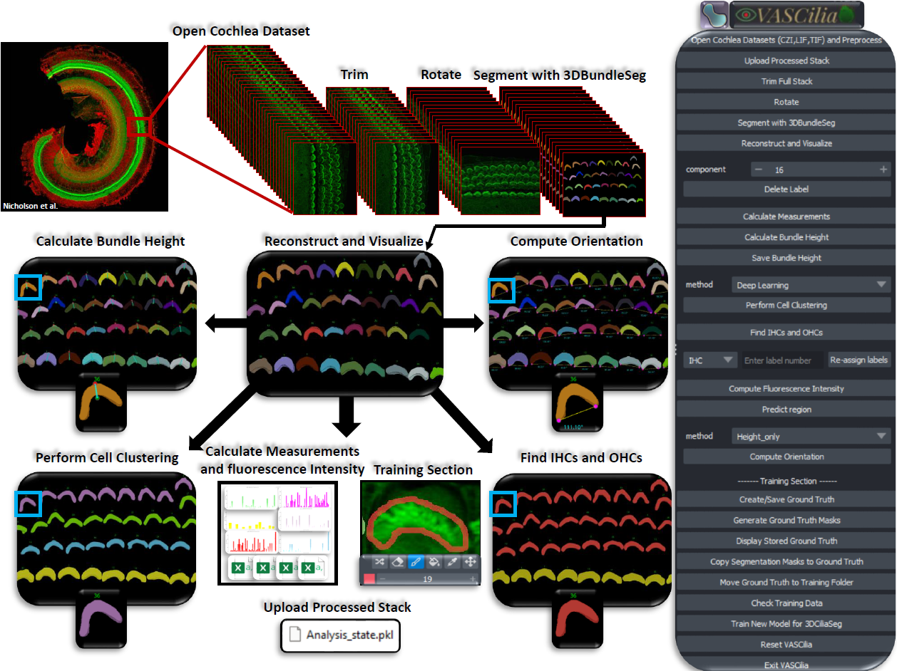
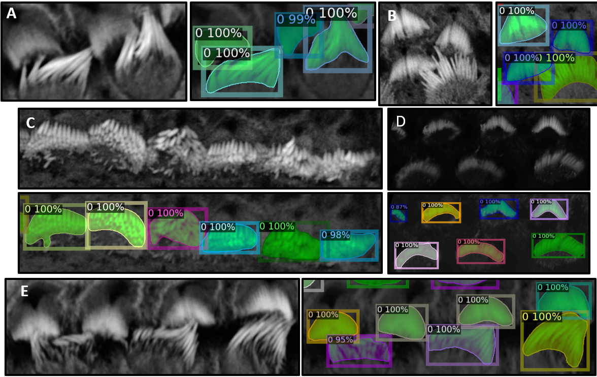
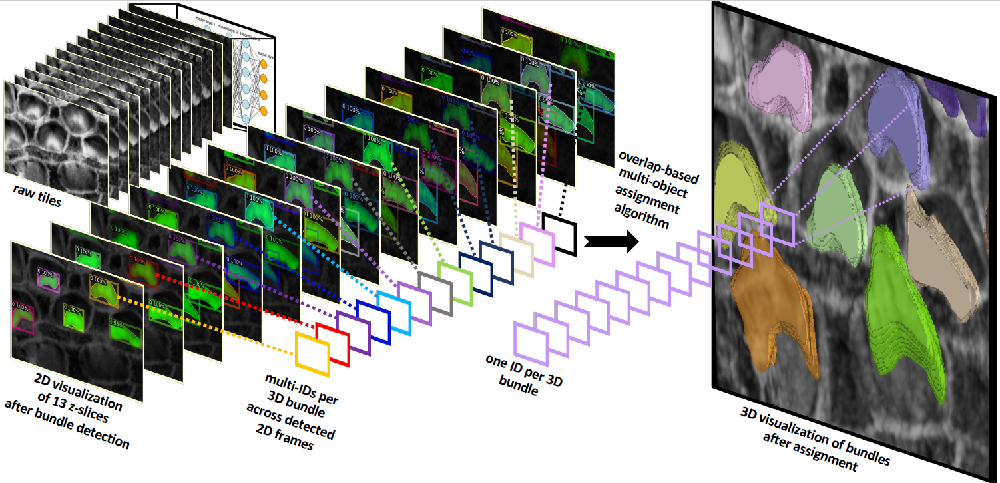
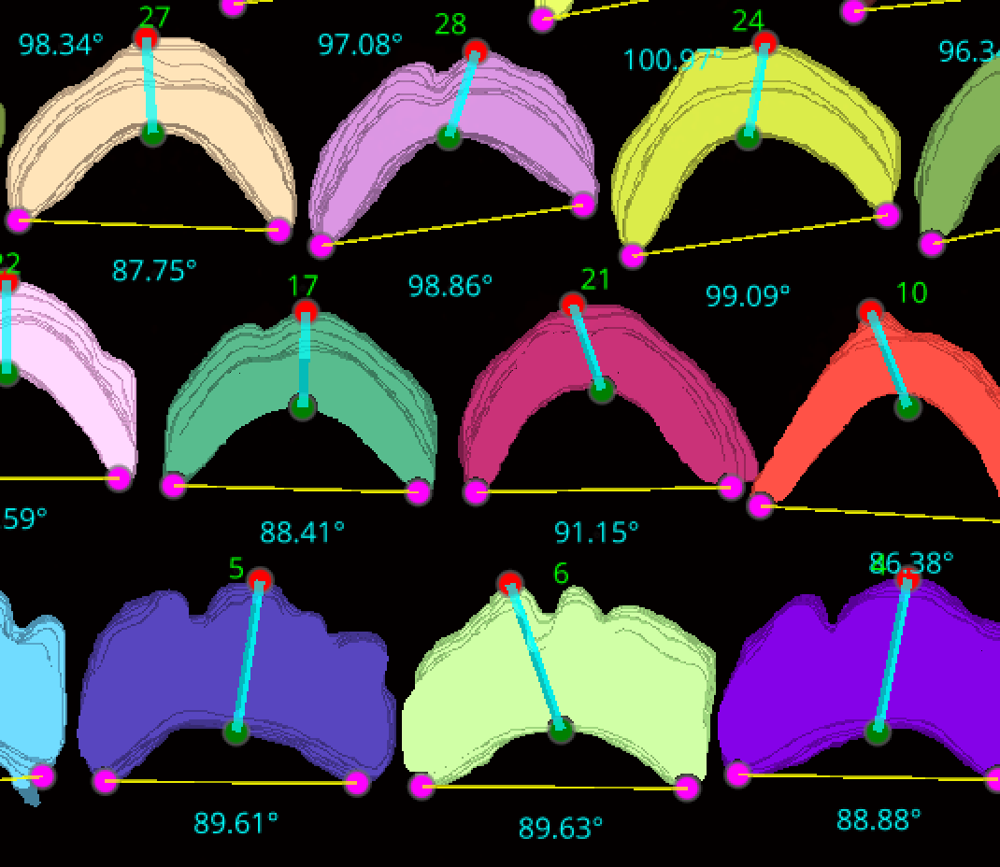
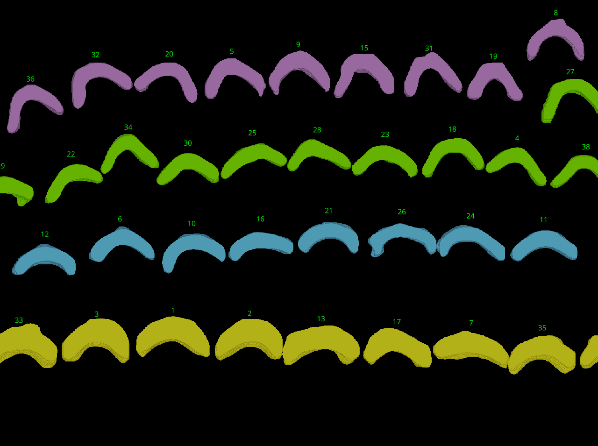
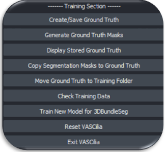

# VASCilia (Vision Analysis StereoCilia): A Napari Plugin for Deep Learning-Based 3D Analysis of Cochlear Hair Cell Stereocilia Bundles 

  

Explore the complexities of the cochlea with VASCilia, a Napari plugin created to aid in the 3D segmentation and quantification of stereocilia bundles. Equipped with a range of thoughtful features, VASCilia stands for (Vision Analysis StereoCilia) and it provides a supportive tool for auditory research, including:  
1. Slice Selection: Easily navigate through 3D stacks to find the slices that matter most for your research.
2. Stack Rotation: Adjust the orientation of your stack to facilitate better analysis.
3. 3D Instance Segmentation: Identify and assess individual bundles with clear separation using deep learning.
4. Bundle Deletion: Remove unwanted bundles to streamline your dataset.
5. Regional Classification: identify whether the region is from BASE, MIDDLE, or APEX in the cochlea using deep learning.
6. Hair Cell Differentiation: Distinguish between Inner Hair Cells and Outer Hair Cells with confidence using deep learning.
7. Measurement Analysis: Calculate various measurements such as volume, centroid location, and surface area.
8. Fluorescence Intensity Analysis: Assess the intensity of signal or protein with detailed precision.
9. 3D Bundle Height Calculation: Measure the 3D distance from the peak to the base of each bundle, according to your sample's resolution.
10. Bundle orientation: Determine bundle orientation for all hair cells based on two strategies: Height-only and Height&Distance.

VASCilia is a valuable resource for the ear research community, simplifying the complexity of measurement and analysis. It comes with a suite of pre-trained models to facilitate 3D segmentation, cell type identification and regional classification.

Furthermore, we are committed to supporting research growth with a comprehensive training section for those looking to explore different staining techniques or develop new segmentation models through annotation and refinement.

VASCilia is here to support researchers in their quest for deeper understanding and innovation in the study of cochlear structures.  
*[click the image to see a highlights reel of the plugin](https://youtu.be/MwMOxJQ_elo)*  

## How to install :  
STEP1[Create the Anaconda enviroment]:  
conda create -y -n napari-VASCilia -c conda-forge python=3.10    
conda activate napari-VASCilia    
pip install torch==1.12.1+cu113 torchvision==0.13.1+cu113 torchaudio==0.12.1 --extra-index-url https://download.pytorch.org/whl/cu113  
pip install segmentation-models-pytorch  
pip install opencv-python  
pip install matplotlib  
pip install imagecodecs  
pip install tifffile  
python -m pip install "napari[all]"  
pip install scikit-learn  
pip install readlif  
pip install czitools==0.4.1  
pip install czifile  
go inside C:\Users\UserName\anaconda3\envs\napari-VASCilia\Lib\site-packages\segmentation_models_pytorch\
segmentation_models_pytorch\init__.py: 
add this import to the file:  
from . import utils  

STEP2[Install WSL]:  
1. Open the Command Prompt and install the Ubuntu 20.04 Distribution by simply copy paste this command  
wsl --install -d Ubuntu-20.04
2. After the setup successfully completes, reboot your computer. Open Ubuntu by typing "Ubuntu" in the search bar. A pop-up window for Ubuntu will appear. To check if CUDA and the GPU are correctly installed and available, type nvidia-smi in the terminal  

STEP3[Download the code and the deep learning trained models]:
1. Download the code from this github  
2. Download the VASCilia_trained_models from https://www.dropbox.com/scl/fo/xh40g5htgw6lnzxfaqf8f/h?rlkey=9di5nl7f1uq2v623cfc9gki7j&dl=0  
and put the downloaded folder, called 'models', inside Napari_VASCilia_v1_0_0 folder.
3. You can now create two more folders, one for raw_data, and one for processed_data inside Napari_VASCilia_v1_0_0 folder.

STEP4[download one dataset to test VASCilia]:  
You can find one sample from our datasets to try in this link https://www.dropbox.com/scl/fo/pg3i39xaf3vtjydh663n9/h?rlkey=agtnxau73vrv3ism0h55eauek&dl=0  
put it inside the raw_data folder

STEP5[Update the path in the config.json]:  
Change config.json according to your path directory and the downloaded models  

Now your folders look like this:
- 📁 **Napari_VASCilia_v1_0_0** `[Folder_path]`
  - 📁 **models** `[Trained models]`
    - 📁 **cell_type_identification_model** `[has weights for cell type identification IHC vs OHC]`
    - 📁 **new_seg_model** `[incase you fine tune the existing model, the new model will be stored here]`
    - 📁 **region_prediction** `[has weights for region prediction]`
    - 📁 **seg_model**  `[has the weights for the 3D instance segmentation model]`
    - 📁 **Train_predict_stereocilia_exe** `[executible needed by the plugin to segment and retrain the model using WSL]`
  - 📁 **processed_data** `[processed data will be stored here]`
  - 📁 **raw_data** `[raw data (stacks) is placed here]`
  - 📁 **src** `[python files are stored here]`
    - 📁 **assets** `[has the logo]`
    - 📁 **core** `[has all the classes code scripts for all VASCilia features]`
    - 📄 **config.json** `[needs to be updated accoring to your paths, please keep /mnt/c/ and update whatever after that]`
    - 📄 **Napari_VASCilia_v1_0_0.py** `[Run this file]`
    - 📄 **ui_setup** `[Plugin setup exists here]`

Congratulations :), now you are ready to run: Run Napari_VASCilia_v1_0_0.py  

## Unique about VASCilia :  
VASCilia saves all the intermediate results and the variables inside a pickle file while the user is using it in a very effiecint way. That allows a super fast uploading for the analysis if the user or their supervisor wants to keep working or review the analysis steps.  
*[Click me to learn how to upload a z-stack](https://youtu.be/Sxm_fsjoWL0)*  

## How to use VASCilia :  
*[Click me to see a video demo of the entire workflow](https://youtu.be/cyc0c9vKGL0)*  

There are several buttons inside the blugin in the right hand side of Napari:

1. 'Open CZI Cochlea Files and Preprocess' button: read the CZI file.
2. 'Upload Processed CZI Stack' button: Incase you already have processed the stack, then just uplead your Analysis_state.pkl that usually has all the variables needed to upload your analysis
3. 'Trim Full Stack' button: this button allows you to choose only the slices of interest (will be automated in the near future)
4. "Rotate' buttom: this button allows to rotate the stack to have proper analysis (will be automated in the near future)  
5. Segment with 3DBundleSeg: it is a two steps algorithm (2D detection + multi-object assignment algorithm across all slices) to produce robust 3D detection. 3DBundleSeg is the first instance segmentation model for stereocilia bundles in the literature. It is trained on P5 and P21 3D stacks (thousands of 2D instances) and it produces highly acccurate boundary delineation even in the most challenging datasets. Here are some examples:  

  <strong>3DBundleSeg can tackle challenged cases</strong>  
   
  

  <strong>Multi-object assignment algorithm to produce robust 3D detection</strong>  
   
  

6. Delete Label 'button': delete the unwanted detection if it is near the boundary or for any other reason.
7. Calculate measurments 'button': calculate different measurments from the detected bundles and store them in csv file
8. Calculate Bundle Height 'button': compute the 3D distance from the highest point in the 3D detection of each bundle to it's base. This calculation will consider the sample resolution.
9. Perform Cell Clustering 'button': find the IHC, OHC1, OHC2, and OHC3 using either GMM, Kmeans or Deep Learning. Those layers will be added to the plugin to be used during the analysis. 
10. Compute Fluorescence Intensity 'button': produce plots and CSV files that has the accumelated intensity and mean intensity for the fluorescence signal.
11. Predict Region 'button': Predict whether the region is from the BASE, MIDDLE, or APEX region using a RESNET50 trained model. 
12. Compute Orientation: It computes the orientation using two strategies.

  <strong>Bundle Height with top and bottom adjustable points in red and green, orientation with two points in magenta, and bundle ID in green</strong>  
   
  

  <strong>Cell type identification (IHC1 in yellow, OHC1 in cyan, OHC2 in green, and OHC3 in magenta)</strong>  
   
  

13. Training Section.

  <strong>Training section</strong>  
   
  

The training section is for the research ear community incase their datasets are little different than ours then they can easily create their cround truth, train a new model and use it in the plugin
1. Create/Save Ground Truth 'button': this button will create a new layer to draw new ground truth and save them as variables inside the plugin
2. Generate Ground Truth Mask 'button': this button will save all the generated masks after finish annotating to a new folder. 
3. Display Stored Ground Truth 'button': this button will display the stored masks in the plugin.
4. Copy Segmentation Masks to Ground Truth 'button': this button helps in speeding up the annotation process by copying what our trained model is producing sothat the annotator will only correct the wrong part.
5. Move Ground Truth to Training Folder 'button': this button will move all the annotated ground truth to the training folder to start the training process. 
6. Check Training Data 'button': this button checks the training data whether they follow the format needed by the architecture. It checks whether there are training and valiation folders and it reads every single file to make sure it doesn't have redundant or no information. It gives warning messages incase it finds an issue.
7. Train New Model for 3DBundleSeg 'button': this button will start the training.

VASCilia also equipped with two more buttons for resetting (to facilitate transitions between analyzing several stacks) and also exit VASCilia.  
We are still working on the documentation, so this gihub will be continiuosly updated.

# VASCilia (Vision Analysis StereoCilia) 

This work will be submitted very soon. If you want to read or cite the paper, you can find it [here](https://doi.org/10.1101/2024.06.17.599381).

### Project Authors and Contacts

**Python Implementation of this repository:** Dr. Yasmin M. Kassim    
**Contact:** ykassim@ucsd.edu, ymkgz8@mail.missouri.edu  
Yasmin Kassim was responsible for the plugin design, fully implemented all functions in Python, wrote the manuscript,
proofread the ground truth data, created all figures, and established the GitHub repository and codebase.

**Stacks used in this study imaged by:** Dr. David Rosenberg   

**Height bundle ground truth analyses**: Samprita Das and Alma Renero.  

**StereoCilia Bundles Ground Truth**: 55 (P5 and P21) 3D stacks were manually annotated by Yasmin Kassim and five undergraduate students using the CVAT annotation tool. This is an extremely challenging process, as each 3D stack might have up to 60 bundles in a 3D setting, which could translate to around 1000 bundles in a 2D setting across all frames. The students involved in this effort are:  
**Samia Rahman, Ibraheem Al Shammaa, Samer Salim, Zhuoling Huang, and Kevin Huang**.

This dataset will be the first annotated dataset in the literature to 3D segment the stereocilia bundles and it will be published and available for the ear research community with the publication of this paper.

**Other Lab Support**:   
Yuzuru Ninoyu assisted with some of the imaging data, with Rick Friedman’s supervision and support.   
Artur Indzhykulian provided additional imaging data for testing.  

**Lab Supervisor:** Dr. Uri Manor   
The Principal Investigator, conceived and supervised the project, and provided critical
revisions and updates to the manuscript.  

**Contact:** u1manor@UCSD.EDU  
**Department:** Cell and Development Biology Department/ UCSD  
**Lab Website:** https://manorlab.ucsd.edu/

