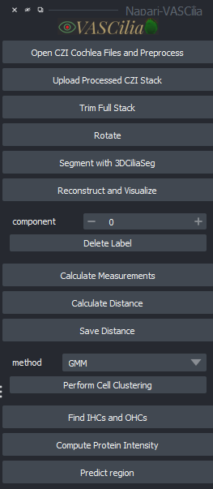
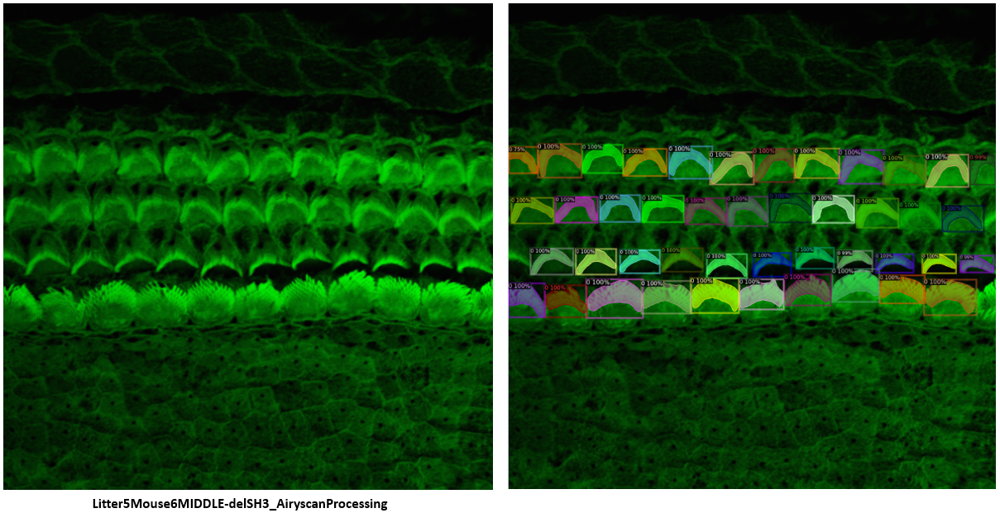
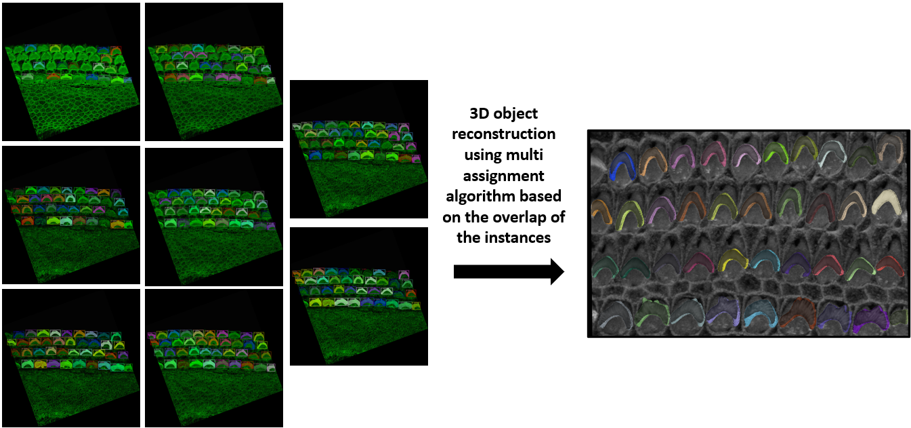
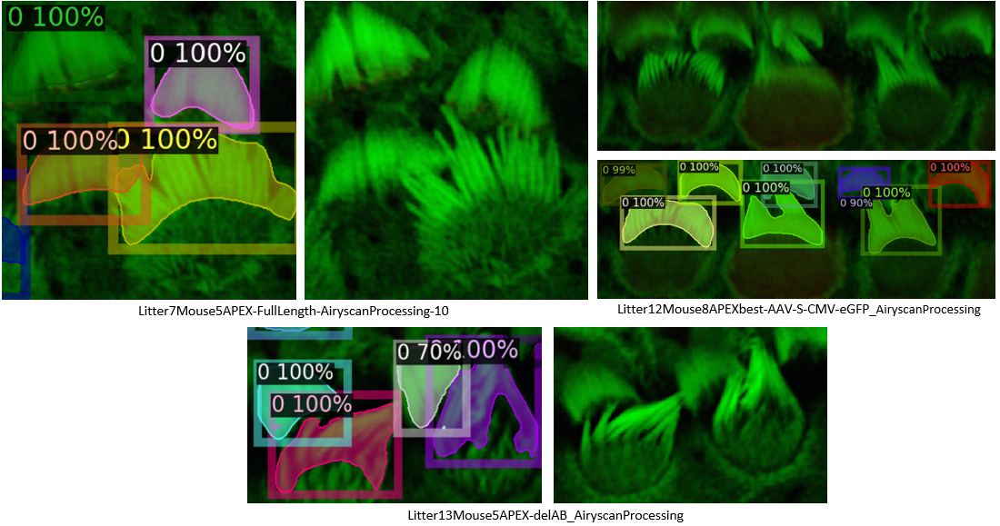

# VASCilia: A Napari Plugin for Cochlear StereoCilia Analysis
Explore the complexities of the cochlea with VASCilia, a Napari plugin created to aid in the 3D segmentation and quantification of stereocilia bundles. Equipped with a range of thoughtful features, VASCilia stands for (Vision Analysis StereoCilia) and it provides a supportive tool for auditory research, including:

1. Slice Selection: Easily navigate through 3D stacks to find the slices that matter most for your research.
2. Stack Rotation: Adjust the orientation of your stack to facilitate better analysis.
3. 3D Instance Segmentation: Identify and assess individual bundles with clear separation.
4. Bundle Deletion: Remove unwanted bundles to streamline your dataset.
5. Regional Classification: identify whether the region is from BASE, MIDDLE, or APEX in the cochlea.
6. Hair Cell Differentiation: Distinguish between Inner Hair Cells and Outer Hair Cells with confidence.
7. Measurement Analysis: Calculate various measurements such as volume, centroid location, and surface area.
8. Protein Intensity Analysis: Assess the intensity of proteins like EPS8 with detailed precision.
9. 3D Distance Calculation: Measure the 3D distance from the peak to the base of each bundle, according to your sample's resolution.

VASCilia is a valuable resource for the ear research community, simplifying the complexity of measurement and analysis. It comes with a suite of pre-trained models to facilitate 3D segmentation and regional classification.

Furthermore, we are committed to supporting research growth with a comprehensive training section for those looking to explore different staining techniques or develop new segmentation models through annotation and refinement.

VASCilia is here to support researchers in their quest for deeper understanding and innovation in the study of cochlear structures.

## How to install :  

conda create -y -n napari-VASCilia -c conda-forge python=3.10  
conda activate napari-VASCilia  
python -m pip install "napari[all]"  
pip install matplotlib  
pip install seaborn  
pip install opencv-python  
pip install czitools  
pip install scikit-learn  
pip install torch torchvision torchaudio  

Download the trained models from https://www.dropbox.com/scl/fo/xh40g5htgw6lnzxfaqf8f/h?rlkey=9di5nl7f1uq2v623cfc9gki7j&dl=0  
Change self.wsl_executable, self.model, self.model_region_prediction and self.model_output_path according to your path directory and the downloaded models  
Now you are ready to run: Run Napari_VASCilia_v1_1_0.py  :)  

You can find one sample from our datasets to try in this link https://www.dropbox.com/scl/fo/pg3i39xaf3vtjydh663n9/h?rlkey=agtnxau73vrv3ism0h55eauek&dl=0

## Unique about VASCilia :  
VASCilia saves all the intermediate results and the variables inside a pickle file while the user is using it in a very effiecint way. That allows a super fast uploading for the analysis if the user or their supervisor wants to keep working or review the analysis steps.

## How to use VASCilia :  
There are many buttoms inside the blugin in the right hand side of Napari:

1. 'Open CZI Cochlea Files and Preprocess' buttom: read the CZI file.
2. 'Upload Processed CZI Stack' buttom: Incase you already have processed the stack, then just uplead your Analysis_state.pkl that usually has all the variables needed to upload your analysis
3. 'Trim Full Stack' buttom: this buttom allows you to choose only the slices of interest (will be automated in the near future)
4. "Rotate' buttom: this buttom allows to rotate the stack to have proper analysis 
5. Segment with 3DCiliaSeg: 3DCiliaSeg is two steps algorithm (2D detection + multi-object assignment algorithm across all slices) to produce robust 3D detection. 3DCiliaSeg is the first instance segmentation model for stereocilia bundles in the literature. It is trained on 46 stacks and it produce highly acccurate boundary delineation even in the most challenging datasets. Here are some examples:  

Stereocilia bundles detection for one frame(slice) of the stack

Multi-object assignment algorithm to produce robust 3D detection

3DCiliaSeg can tackles challenged cases

3DCiliaSeg perfomance reaches F1 measure = 99.4% and Accuracy = 98.8% 

7. Delete Label 'buttom': delete the unwanted detection if it is near the boundary or for any other reason.
8. Calculate measurments 'buttom': calculate different measurments from the detected bundles and store them in csv file
9. Calculate Distance 'buttom': compute the 3D distance from the highest point in the 3D detection of each bundle to it's base. This calculation will consider the sample resolution.
10. Perform Cell Clustering 'buttom': find the IHC, OHC1, OHC2, and OHC3 using either GMM or Kmeans. Those layers will be added to the plugin to be used during the analysis. 
11. Compute Protein Intensity 'buttom': produce plots and CSV files that has the accumelated intensity and mean intensity for the protein signal (here it is eps8 protein).
12. Predict Region 'buttom': Predict whether the region is from the BASE, MIDDLE, or APEX region using a RESNET50 trained model. 

This section is for the research ear community incase their datasets are little different than ours then they can easily create their cround truth, train a new model and use it in the plugin
1. Create/Save Ground Truth 'buttom': this buttom will create a new layer to draw new ground truth and save them as variables inside the plugin
2. Generate Ground Truth Mask 'buttom': this buttom will save all the generated masks after finish annotating to a new folder. 
3. Display Stored Ground Truth 'buttom': this buttom will display the stored masks in the plugin.
4. Copy Segmentation Masks to Ground Truth 'buttom': this buttom helps in speeding up the annotation process by copying what our trained model is producing sothat the annotator will only correct the wrong part.
5. Move Ground Truth to Training Folder 'buttom': this buttom will move all the annotated ground truth to the training folder to start the training process. 
6. Check Training Data 'buttom': this buttom checks the training data whether they follow the format needed by the architecture. It checks whether there are training and valiation folders and it reads every single file to make sure it doesn't have redundant or no information. It gives warning messages incase it finds an issue.
7. Train New Model for 3DCiliaSeg 'buttom': this buttom will start the training.

We have also two more buttoms for resetting and also exit VASCilia.
We are still working on adding more features to the plugin, so this gihub will be continiuosly updated with new versions.

### Project Authors and Contacts

**Python Implementation of this repository:** Dr. Yasmin M. Kassim    
**Contact:** ykassim@ucsd.edu

**Stacks used in this study imaged by:** Dr. David Rosenberg   
**Contact:** d2rosenberg@UCSD.EDU

46 stacks are manually annotated by Yasmin Kassim and four undergraduate students using CVAT annotation tool: Samia Rahman, Ibraheem Al Shammaa, Samer Salim, and Kevin Huang.

We are working on annotatating more data for adult mice. This dataset will be the first annotated dataset in the literature to 3D segment the stereocilia bundles and it will be published and available for the ear research community with the publication of this paper.

**Lab Supervisor:** Dr. Uri Manor   
**Contact:** u1manor@UCSD.EDU  
**Department:** Cell and Development Biology Department/ UCSD  
**Lab Website:** https://manorlab.ucsd.edu/

