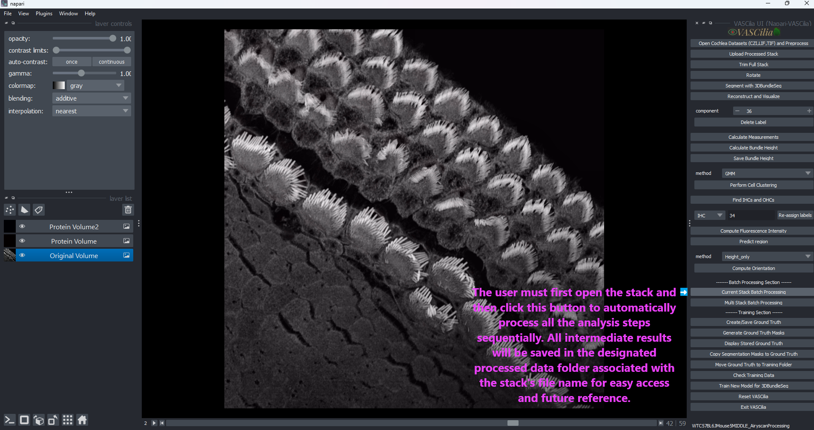
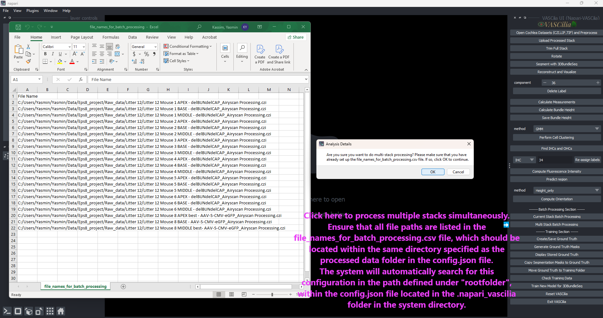

Batch Processing
=================

The **Batch Processing** feature in **VASCilia** automates the pipeline for analyzing cochlear stacks, streamlining workflows from trimming and rotation to segmentation and advanced measurements. It supports both single-stack and multi-stack processing for high-throughput analysis.

Key Features
------------

1. **Single-Stack Processing**:
   - Combines multiple steps, including trimming, rotation, segmentation, distance calculation, cell type identification, and protein signal computation, into a single operation.

2. **Multi-Stack Processing**:
   - Processes multiple stacks specified in a `file_names_for_batch_processing.csv` file.
   - Handles different file formats (`.czi`, `.lif`, `.tif`) and verifies file paths for validity.

3. **AI Assistance**:
   - Utilizes AI models for trimming start/end indices and stack rotation.

4. **Comprehensive Analysis**:
   - Includes segmentation, tracking, distance measurement, orientation computation, and signal intensity analysis.

5. **Customizable Options**:
   - Supports various analysis methods such as clustering (`Deep Learning`, `GMM`, `KMeans`) and orientation calculation (`Height_only`, `Height_Distance`).

6. **Logging and Validation**:
   - Logs invalid file paths during multi-stack processing for troubleshooting.

Single-Stack Workflow
---------------------

1. **Trimming**:

   - Automatically determines start and end indices using AI.
   - Copies frames within the specified range to a new directory for further processing.

2. **Rotation**:

   - AI predicts the rotation angle to align cochlear stacks.
   - Applies the calculated angle to all frames and saves the rotated images.

3. **Segmentation and Tracking**:

   - Segments cochlear regions using pre-trained models.
   - Tracks regions across frames using the SORT algorithm.

4. **Measurements and Distance Calculation**:

   - Computes 3D measurements for labeled volumes.
   - Calculates the distance from the peak to the base of each region.

5. **Cell Type Identification**:

   - Identifies inner hair cells (IHC) and outer hair cells (OHC1, OHC2, OHC3) using deep learning or clustering methods.

6. **Protein Intensity Analysis**:

   - Computes mean and total signal intensities for labeled regions.

7. **Orientation Computation**:

   - Calculates angles and alignment for cochlear structures using height-based methods.

Multi-Stack Workflow
---------------------

1. **Prepare Input File**:

   - Create a `file_names_for_batch_processing.csv` file listing paths to stacks for processing.

2. **Initiate Multi-Stack Processing**:

   - Confirm multi-stack processing in the plugin.
   - Validates file paths and processes each stack sequentially.

3. **Process Each Stack**:

   - Executes single-stack workflow steps for each valid file.
   - Logs invalid paths for troubleshooting.

4. **Save Results**:

   - Outputs results for all processed stacks, including trimmed and rotated stacks, segmented regions, distance measurements, cell type classifications, protein intensities, and orientation data.

Example Workflow
----------------

### Single-Stack

1. Click **Current Stack Batch Processing** to initiate the workflow.

### Multi-Stack

1. Prepare the `file_names_for_batch_processing.csv` file with stack paths.
2. Click **Multi Stack Batch Processing** for multiple stacks and confirm the operation.

Practical Considerations
------------------------

- Ensure required AI models are loaded correctly for trimming, rotation, and cell type identification.
- Results are saved at each stage for reproducibility and further analysis.
- Adjust clustering or orientation computation methods as needed.
- For multi-stack processing, verify the input file format and paths before starting the operation.
- Ensure that all file paths are listed in the file_names_for_batch_processing.csv file, which should be located within the same directory specified as the processed data folder in the config.json file.

The system will automatically search for this configuration in the path defined under "rootfolder", within the config.json file located in the .napari_vascilia folder in the system directory.

Extending the Functionality
---------------------------
To add or modify functionality, edit the following files:

    - **batch_action.py** and
    - **process_multiple_stacks.py**

---

---

