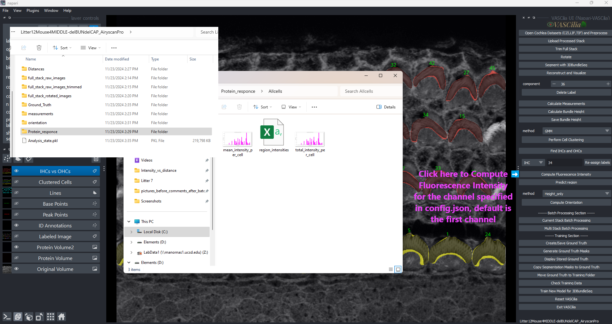

Signal Computation
==================

The **Compute Fluorescense Intensity** feature in **VASCilia** allows users to compute and visualize signal intensities for labeled volumes. This tool facilitates the analysis of protein responses and other cellular signals within cochlear datasets, supporting downstream quantitative analyses.

Key Functionalities
-------------------

1. **Intensity Calculation**:
   - Computes **mean intensity** and **total intensity** for each region in 3D setting, with background subtraction for more accurate measurements.

2. **Visualization**:
   - Generates bar plots for both mean and total intensity for each stereocilia bundle.
   - Saves plots as `.png` files for reporting and documentation.

3. **CSV Export**:
   - Exports computed intensities (mean and total) for each region into a CSV file for further analysis.

4. **Support for Multiple Cell Types**:
   - Computes signal responses for:

     - **All cells**.
     - **Inner Hair Cells (IHCs)**.
     - **Outer Hair Cells (OHCs)**, including subtypes OHC1, OHC2, and OHC3.

Intensity measurement options
-----------------------------

- **``signal_intensity_channel``** (*integer*)  
  The parameter ``signal_intensity_channel`` in ``config.json`` determines which image channel will be analyzed.  
  You can modify this value to generate plots and CSV files for different fluorescence channels,  
  **but you must restart Napari after each change** for it to take effect.

  **Important:** To determine the correct channel number, open the ``raw_images`` folder inside your dataset (within ``processed_data``).  
  Assign **``signal_intensity_channel``** to:  
     - ``0`` → if you want to quantify the signal that appears **red** in the image  
     - ``1`` → if you want to quantify the signal that appears **green** in the image  
     - ``2`` → if you want to quantify the signal that appears **blue** in the image (if present)

**Note:**  
  Once a stack has been processed, VASCilia will always read the same channel that was used during its initial processing if you use the ubload button — even if you later update the config file.  
  To safely switch to a different fluorescence channel:

  1. **Delete the processed stack** from your ``processed_data`` folder.  
  2. **Verify the correct color channel as you observed in your ``raw_images`` folder.**  
  3. Update ``signal_intensity_channel`` in ``config.json`` to the appropriate value.  
  4. **Restart Napari** and reprocess the stack.

  This ensures that computed intensities correspond to the correct fluorescence channel and prevents mismatched data.

Workflow
--------

1. **Preprocessing**:
   - Loads and processes the 3D labeled volume.
   - Applies localized binary dilation within the bounding box of each labeled region. 

2. **Signal Intensity Computation**:
   - Reads intensity images from the specified signal channel.
   - Subtracts background intensity and computes the mean and total intensity for each labeled region.

3. **Visualization**:
   - Plots bar charts for mean and total intensity for all regions and saves them to respective directories.

4. **File Management**:
   - Outputs intensity data and plots into a structured directory under `Protein_responce/`.

Directory Structure
-------------------

Generated results are saved in the following directory structure:

.. code-block:: bash

   Intensity_response/
   ├── Allcells/
   │   ├── region_intensities.csv     
   │   ├── All_bundles_per_layer_intensity.csv
   ├── IHCs/
   ├── OHCs/
   ├── OHC1/
   ├── OHC2/
   └── OHC3/

Usage Instructions
------------------

1. **Compute Signals**:
   - Click the **Compute Fluorescense Intensity** button in the plugin interface.
   - Review the generated plots and CSV files for intensity measurements.

2. **Analyze Outputs**:
   - Use the exported CSV files and plots for further analysis or reporting. 
   - region_intensities.csv shows the total and mean intensity in 3D settings, while All_bundles_per_layer_intensity.csv shows them per layer. As a results user can do three post analysis options. Those options are available in the downstream_analysis folder (extend_intensity_csv_to_options.py). This code offers three alternative aggregation modes for per-bundle fluorescence intensity: (i) the sum of raw intensities across all detected layers for each bundle; (ii) the sum restricted to the top (n) layers, where (n) is the largest depth shared by all bundles being compared; and (iii) the sum obtained by padding shallower bundles to (n) layers by repeating the bundle’s weakest-layer value, where n is the maximum depth across bundles.

Practical Considerations
------------------------
- **Dilation**:
  - This feature is effective with proteins on tips such as eps8 protein. Dilation can be triggured only when "dilate_labels":true in the config file

- **Background Subtraction**:
  - Background intensity is computed using unlabeled regions (label = 0) and subtracted from each region's intensity.
    This feature can be enabled by enabling this parameter in the config file  "subtract_background":true

- **Custom Signal Channels**:
  - Signal intensity can be calculated from any specified channel using the "signal_intensity_channel" in the config.json file inside .napari-vascilia in your system path.

    "signal_intensity_channel": 0  for calculating the first channel intensity
    "signal_intensity_channel": 1  for calculating the second channel intensity
    "signal_intensity_channel": 2  for calculating the third channel intensity

- **Visualization Colors**:
  - Bar plots use distinct colors for each cell type for clarity:

    - **All cells**: Magenta.
    - **IHCs**: Yellow.
    - **OHCs**: Red.
    - **OHC1**: Skyblue.
    - **OHC2**: Light green.
    - **OHC3**: Thistle.

Output Examples
---------------

1. **Mean Intensity**:
   - A bar chart showing the mean intensity for each region, with a clear distinction of cell types.

2. **Total Intensity**:
   - A bar chart showing the total signal intensity for each region, normalized for comparison.

3. **Bar Plots**:
   - Two bar plots for each cell type

Extending the Functionality
---------------------------
To add or modify functionality, edit the following file:
    - **compute_signal_action.py**

---

