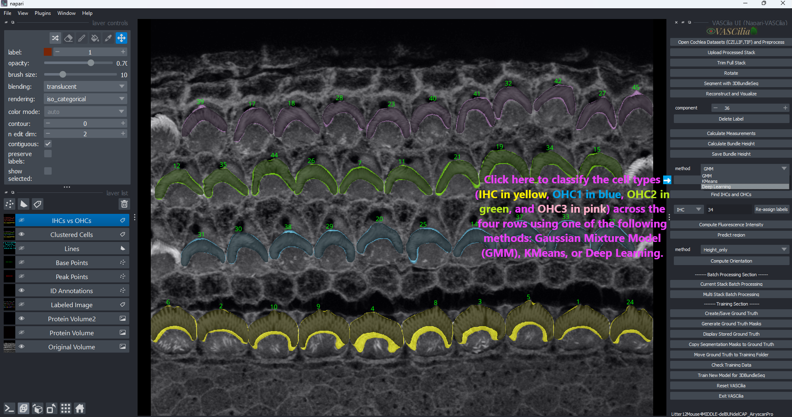
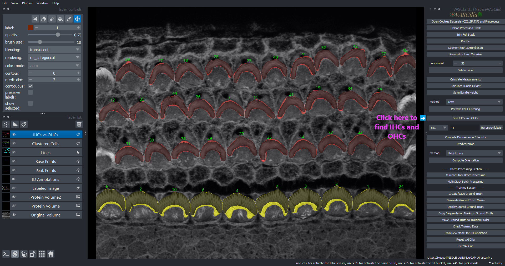

Cell Clustering
===============

The **Cell Clustering** feature in **VASCilia** enables the classification of cochlear cells into specific types such as Inner Hair Cells (IHCs) and Outer Hair Cells (OHCs) using various clustering methods. This feature supports both unsupervised clustering techniques and deep learning models for accurate cell identification.

Key Features
------------

1. **Clustering Methods**:

   - **Gaussian Mixture Models (GMM)**: Clusters cells based on Gaussian distribution assumptions.
   - **KMeans**: Groups cells using distance-based partitioning.
   - **Deep Learning**: Leverages pretrained deep learning models for advanced cell classification.

2. **Cell Types**:

   - Inner Hair Cells (**IHC**).
   - Outer Hair Cells (**OHC**), including subtypes:
     - **OHC1**
     - **OHC2**
     - **OHC3**

3. **Interactive Reassignment**:
   - Allows users to manually reassign cell labels to specific types using an intuitive interface.

4. **Visualization**:
   - Displays clustered cells in distinct layers:

     - **Clustered Cells**: Colored visualization of all clusters.
     - **IHCs vs OHCs**: Separate visualization for IHCs and OHCs.

5. **Distance Integration**:
   - Updates the saved physical distances with corresponding cell type classifications.

Workflow
--------

### **Perform Cell Clustering**

    1. Choose a clustering method:

        - **GMM** or **KMeans**: Groups cells based on centroid positions.
        - **Deep Learning**: Uses signal intensity and pretrained models to classify cells.

    2. Click **Perform Cell Clustering** to initiate the clustering process.
    3. Review the resulting clustered layers.

### **Reassign Clustering**

    1. Select the desired cell type (e.g., IHC, OHC1).
    2. Enter the label number to reassign.
    3. Click **Re-assign Labels** to update the clustering.

Practical Considerations
------------------------

- **Clustering Preconditions**:

  - Ensure that bundle height calculation is complete and saved before performing clustering.
  
- **Deep Learning Models**:

  - Utilizes pretrained models (`best_model_ihc_v3.pth`, etc.) for precise cell classification.

- **Visualization**:

  - **Clustered Cells**: Uses distinct colors for easy identification.
  - **IHCs vs OHCs**: Differentiates IHC and OHC clusters with unique labels.

Directory Structure
-------------------

Outputs are saved in the **Distances** directory under the project folder. The Physical_distances.csv will have a new column called 'CLass' beside the 'Distance' column

.. code-block:: bash

   Distances/
   ├── Physical_distances.csv  # Includes updated cell type classifications.

Usage Instructions
------------------

1. Perform clustering using the **Perform Cell Clustering** button.
2. Adjust or reassign cell types using the **Re-assign Labels** tool.
3. Review and validate the updated clustering in the viewer.
4. Save changes for downstream analysis.

Output Examples
---------------

- **Clustered Cells**: Visualizes cells with distinct colors:

  - **IHC**: Blue.
  - **OHC1**: Yellow.
  - **OHC2**: Green.
  - **OHC3**: Purple.

- **Physical_distances.csv**:

  - Includes the `ID` and `Class` columns with updated classifications.

This feature streamlines cell type identification and classification, supporting advanced analysis of cochlear data.

Extending the Functionality
---------------------------
To add or modify functionality, edit the following file:

    - **identify_celltype_action.py**

---

---

