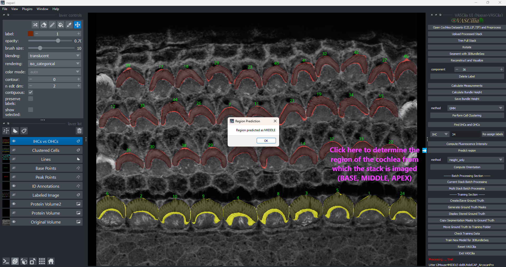

Region Prediction
==================

The **Tonotopic Region Prediction** feature in **VASCilia** identifies the cochlear region (APEX, MIDDLE, BASE) for labeled volumes using a deep learning model. This tool streamlines tonotopic regional classification by analyzing a subset of images and providing a majority-vote-based prediction.

Key Features
------------

1. **Deep Learning-Based Classification**:

   - Utilizes a ResNet-50 model fine-tuned for cochlear region prediction.
   - Predicts one of three regions: **APEX**, **MIDDLE**, or **BASE**.

2. **Subset Analysis**:

   - Analyzes a subset of images from the middle of the dataset for efficient and accurate region prediction.
   - Default configuration processes 13 images for majority voting.

3. **Majority Vote Decision**:

   - Combines predictions from selected images to determine the most likely region.
   - Outputs the final prediction based on the most common class.

Usage Instructions
------------------
1. **Run Region Prediction**:

   - Trigger the **Region Prediction** feature to start the analysis.

2. **View Results**:

   - The predicted region (APEX, MIDDLE, or BASE) will be displayed in a pop-up message.

Model Details
-------------

- **Architecture**: ResNet-50
- **Custom Output**: Adjusted fully connected layer for three classes.
- **Input Preprocessing**:

  - Resize to 256x256 pixels.
  - Center crop to 224x224 pixels.
  - Normalize using ImageNet mean and standard deviation.

Example Output
--------------

A pop-up message shows the predicted cochlear region:

    Region predicted as MIDDLE

Practical Considerations
------------------------

- Ensure that the model file (`model_region_prediction`) is correctly loaded in the plugin.
- The default configuration processes 13 images but can be adjusted as needed.
- The method assumes that the dataset represents a continuous stack of images from a cochlea.

Extending the Functionality
---------------------------
To add or modify functionality, edit the following file:

    - **predict_tonotopic_region.py**

---

