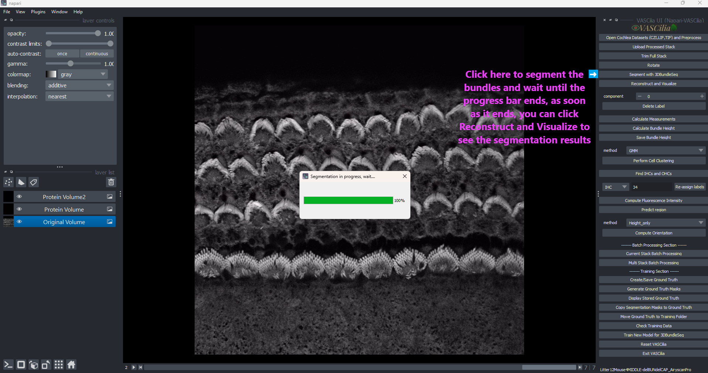

3D Segmentation of Cochlea Stacks
=================================

The **3D Segmentation** feature in VASCilia leverages deep learning to segment cochlear hair cell stacks, providing precise identification of cellular regions for further analysis. This process is automated using a pretrained model and is seamlessly integrated into the workflow.

---

Key Features
------------

### Deep Learning-Based Segmentation

    - Utilizes a model trained on **Detectron2**, with the **Mask R-CNN R-50 FPN 3x** architecture.
    - Trained with **45 manually annotated cochlear stacks**, ensuring high accuracy and reliability for segmentation.
    - Automatically segments 3D stacks to identify and analyze specific cellular regions.

### Integrated Workflow

    - Ensures segmentation occurs after the **Rotation** step, aligning the cochlear stacks with the PCP (planar cell polarity).
    - Updates the analysis stage upon successful segmentation, ensuring smooth progression through the pipeline.

### Customizable Parameters

    - Allows user configuration for:
    - Number of training iterations.
    - Threshold values for segmentation.
    - Output model paths for storing segmentation results.

---

Usage Instructions
------------------

### Step 1: Prepare for Segmentation

    - Ensure that the stack is aligned using the **Rotate** functionality.
    - Verify that the analysis stage is set correctly; segmentation requires that the analysis stage is **3 (Rotated)**.

### Step 2: Execute Segmentation

    1. Click the **Segment with 3DBundleSeg** button in the plugin.
    2. The system will:
        - Prepare the dataset and paths.
        - Run the segmentation model using the configured parameters.

### Step 3: Monitor Progress

    - A **progress dialog** will display during segmentation, showing real-time updates.
    - Upon completion, results are saved in the designated output directory.

---

Technical Details
-----------------

### Pretrained Model

    - The segmentation model is trained using **Detectron2** with:
    - **Mask R-CNN R-50 FPN 3x** architecture.
    - Trained with **45 manually annotated cochlear stacks** to detect cellular regions with precision.

### Segmentation Command
The plugin constructs and executes a command to perform segmentation, for example:

.. code-block:: bash

   wsl {path_to_executable} --train_predict 1 \
   --folder_path {train_folder} \
   --model_output_path {output_model_path} \
   --iterations {train_iter} \
   --rootfolder {current_folder} \
   --model {model_path} \
   --threshold 0.7

### Progress Monitoring
- The progress bar updates in real time by parsing output messages from the segmentation process.
- The dialog closes automatically once the process completes.

---

Why Segmentation is Important
-----------------------------
Cochlear hair cells are intricate structures requiring detailed 3D analysis. Proper segmentation allows researchers to:

    - Identify cellular regions for focused study.
    - Quantify cellular dimensions and properties.
    - Ensure accurate downstream processing for visualization and analysis.

---

Practical Considerations
------------------------

1. **Pre-Requirements**:

   - Rotation of the stack is mandatory before segmentation.
   - Verify that the required `wsl_executable` path and model paths are correctly set in the `config.json`.

2. **Error Handling**:

   - If segmentation is attempted at the wrong stage, the plugin will notify the user to rotate the stack first.
   - If the stack has already been segmented, the plugin will prevent redundant processing.

3. **Output Files**:

   - The segmented results are stored in the output folder configured in `config.json`.

---

Extending the Functionality
---------------------------
To add or modify functionality, edit the following files:

    - **segment_cochlea_action.py**: Handles the segmentation process.

To fine-tune our model with your images, use the Training Sction

---

