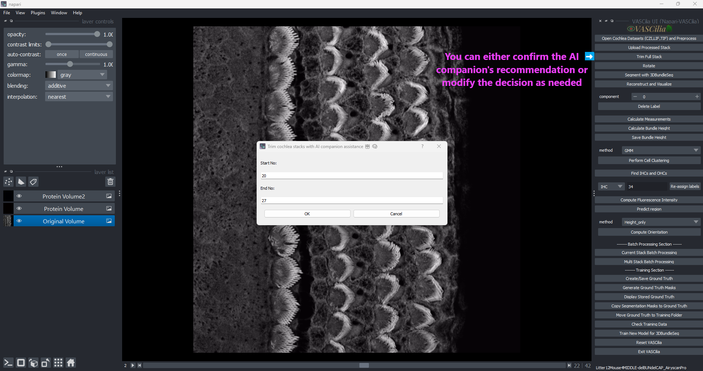

Trim Cochlea Stacks
===================

The **Trim Cochlea Stacks** feature in **VASCilia** enables users to refine cochlear data by selecting specific stack ranges for analysis. This process is supported by an AI-assisted companion and manual inputs, ensuring flexibility and accuracy.

**Why Trimming is Important**
Cochlear stacks typically consist of three distinct regions:

1. **Pre-Cellular Zone**: The region preceding cellular structures.
2. **Clear Cellular Zone**: The region containing clear cellular data of interest.
3. **Noise Cellular Zone**: The region containing noise or irrelevant data.

Trimming allows users to focus on the **Clear Cellular Zone**, which is critical for accurate analysis, while removing unnecessary or noisy regions.

Key Features
------------

1. **AI-Assisted Suggestions**:

   - Utilizes a custom AI model to recommend start and end indices for trimming stacks.
   - Streamlines the process by providing initial suggestions based on stack analysis.

2. **Interactive Dialog**:

   - Displays a user-friendly interface for inputting or adjusting the trimming range.
   - Allows manual edits to fine-tune the suggested range.

3. **Error Handling**:

   - Ensures a minimum of two frames are trimmed for valid analysis.
   - Prompts users to enter valid start and end indices if inputs are missing or incorrect.

4. **File Organization**:

   - Creates a dedicated folder, `full_stack_raw_images_trimmed`, to store trimmed stacks.
   - Automatically copies and organizes the selected stack range into this folder.

Example Workflow
----------------

1. Click the **Trim Cochlea Stacks** button.
2. Confirm or adjust the AI-suggested range in the dialog box.
3. Click **OK** to save the trimmed stack.
4. View the trimmed results in the `full_stack_raw_images_trimmed` folder.

Trim AI Prediction: Automatic Start and End Index Selection
===========================================================

The **Trim AI Prediction** module in **VASCilia** assists in the automated selection of start and end indices for trimming cochlear stacks. It uses a custom deep learning model, `ImprovedZSOINetModel`, to classify each frame and identify the optimal range.

### **Why AI Prediction is Critical**
The AI model ensures accurate identification of the **Clear Cellular Zone**, avoiding both pre-cellular and noise cellular regions. This enhances the quality and precision of subsequent analysis.

Key Components
--------------

1. **Deep Learning Model: ImprovedZSOINetModel**:

   - Five convolutional layers (Conv2d) with batch normalization and ReLU activation.
   - Max pooling layers to reduce spatial dimensions.
   - Two fully connected layers for classification with dropout for regularization.
   - Supports up to three classes for classification, customizable via `nb_classes`.

2. **Prediction Workflow**:

   - Processes each stack frame and predicts its class:
   - Resizes images to `256x256`.
   - Converts them to tensors.
   - Normalizes pixel values to a mean of `0.5` and a standard deviation of `0.5`.
   - Applies softmax to generate probabilities and selects the class with the highest probability.

3. **Index Range Detection**:

   - Identifies the longest continuous block of valid frames (class 1).
   - Determines the start and end indices for this block.

4. **Model Integration**:

   - Pre-trained model: `best_model_ZSOI_ImprovedZSOINetModel_alldata.pth`.
   - Loaded during execution in evaluation mode for inference.

Workflow and Usage
------------------

1. **Image Preprocessing**:

   - Each image is resized, normalized, and converted to a tensor before being passed to the model.

2. **Batch Prediction**:

   - Classifies all stack frames using the trained model.
   - Predictions are stored in a dictionary mapping filenames to predicted classes.

3. **Index Detection**:

   - Scans predictions to find the longest consecutive block of valid frames.
   - Returns the starting and ending indices of this block.

4. **Output**:

   - Provides start and end indices to the trimming module for further processing.

Practical Considerations
------------------------

**Model Requirements**:

   - Ensure the pre-trained model is available in the `model_ZFT_prediction` directory.
   - Model filename: `best_model_ZSOI_ImprovedZSOINetModel_alldata.pth`.

Extending the Functionality
---------------------------
To add or modify functionality, edit the following files:

    - **trim_cochlea_action.py**
    - **trim_AI.py**

---

