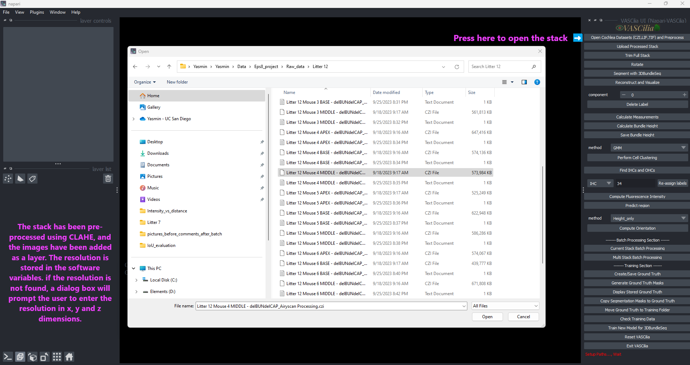
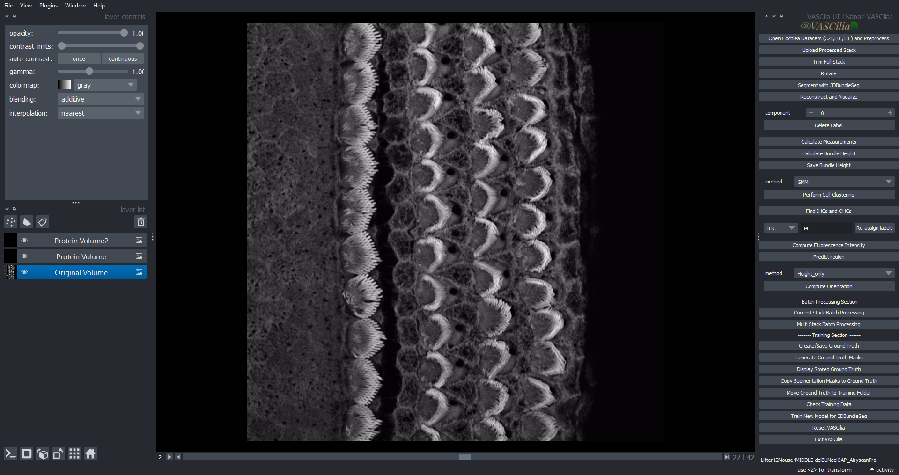

Open Image
==========

The `Open Image` feature in **VASCilia** enables users to load, preprocess, and analyze cochlear datasets in `.czi`, `.lif`, and `.tif` file formats. This feature provides tools for file handling, preprocessing, resolution management, and organized data output.

Key Features
------------

1. **Supported File Formats**:
   - **CZI**: Zeiss confocal images.
   - **LIF**: Leica Image File format.
   - **TIF**: Tagged Image File format.

2. **Preprocessing Capabilities**:
   - Applies CLAHE (Contrast Limited Adaptive Histogram Equalization) for improved contrast.
   - Resizes or pads images to ensure consistent dimensions.
   - Converts image stacks to RGB format.

3. **Physical Resolution Management**:
   - Automatically extracts resolution data (X, Y, Z) from file metadata.
   - Prompts users to input resolution manually if metadata is unavailable.

4. **Error and Path Handling**:
   - Validates configuration paths in `config.json`.
   - Provides clear error messages for missing or invalid paths.

5. **Batch Processing**:
   - Supports single or multiple dataset loading for streamlined analysis.

6. **Organized Outputs**:
   - Saves data in structured folders:
   - `processed_data`: 'full_stack_raw_images' folder

---

Differences in File Handling
----------------------------

Each file format is handled differently based on structure and metadata availability.

# `.czi` (Zeiss Confocal Images)

    - **Channel Support**:

        - Reads two channels by default, configured in config.json as:

        .. code-block:: json

            "green_channel": 0,
            "red_channel": 1,
            "blue_channel": -1

        - Additional channels are configurable:

            - `blue_channel: 2` will read the third channel as blue.
            - `blue_channel: 4` will read the fourth channel as blue.

    - **Workflow**:

        - Extracts image data and combines red, green, and blue channels into an RGB stack.
        - Applies CLAHE to enhance contrast.

# `.lif` (Leica Image Format)

    - **Channel Support**:

        - Processes a **single channel** (typically the green channel).

    - **Workflow**:

        - Processes the second image stack by default if multiple stacks exist.
        - Prompts for manual resolution input if metadata is unavailable.
        - Separates the green channel for processing and saves the enhanced stack.

# `.tif` (Tagged Image File Format)

    - **Channel Handling**:

        - Supports both 3D (frames, height, width) and 4D (frames, channels, height, width) datasets:
        - For 3D, assumes the green channel and initializes empty red and blue channels.
        - For 4D, reads channels based on the `config.json` file.

    - **Workflow**:

        - Combines channels into RGB format for each frame.
        - Applies CLAHE to each channel individually for enhanced contrast.

---

Summary of File Handling
------------------------

.. list-table::
   :header-rows: 1

   * - File Format
     - Channel Support
     - Resolution Handling
     - Preprocessing Features
   * - `.czi`
     - Configurable (2 by default), 3 if blue_channel in config.json is not -1
     - Extracted automatically
     - CLAHE, resizing, padding
   * - `.lif`
     - 1 (green channel only)
     - Requires user input
     - CLAHE, resizing, padding
   * - `.tif`
     - Configurable (1 for 3D, multiple for 4D) based on "green_channel":0, "red_channel": 1, "blue_channel": 2 in config.json
     - Requires user input
     - CLAHE, resizing, padding

---

Handling Padding and Resizing
-----------------------------

VASCilia includes functionality for resizing and padding image stacks during preprocessing. These settings are configurable in the `config.json` file.

### Configuration Options

.. code-block:: json

   {
       "flag_to_resize": false,
       "flag_to_pad": false,
       "resize_dimension": 1200,
       "pad_dimension": 1500
   }

1. **`flag_to_resize`**:
   - If `true`, resizes images smaller than `resize_dimension` while maintaining the aspect ratio.

2. **`flag_to_pad`**:
   - If `true`, pads images to ensure they meet the `pad_dimension`.

3. **`resize_dimension`**:
   - Target dimension for resizing, applied to the smaller of the height or width.

4. **`pad_dimension`**:
   - Final dimensions for padded images.

### Resizing Workflow
- If `flag_to_resize` is enabled, the smaller dimension is scaled to match `resize_dimension` while maintaining the aspect ratio.

.. code-block:: python

   scale_factor = resize_dimension / min(height, width)
   new_height = int(height * scale_factor)
   new_width = int(width * scale_factor)

### Padding Workflow
- If `flag_to_pad` is enabled, black padding is added equally to all sides to meet the `pad_dimension`.

.. code-block:: python

   pad_height = max(0, pad_dimension - new_height)
   pad_width = max(0, pad_dimension - new_width)

   padded_image = np.pad(
       image_resized,
       ((pad_height // 2, pad_height - pad_height // 2), (pad_width // 2, pad_width - pad_width // 2), (0, 0)),
       mode='constant'
   )

---

Usage Instructions
------------------

### Step 1: Load an Image
- Use the **Open Image** button to select a file.
- If a stack is already loaded, click **Reset VASCilia** to start a new session.

### Step 2: Process the Stack
- Supported formats: `.czi`, `.lif`, `.tif`.
- Preprocessing includes normalization, CLAHE, resizing, and padding.

### Step 3: Save Results
- Processed images are saved in the `processed_data` folder.

Extending the Functionality
---------------------------
To add or modify functionality, edit the following file:
- **open_cochlea_action.py**

---

---

