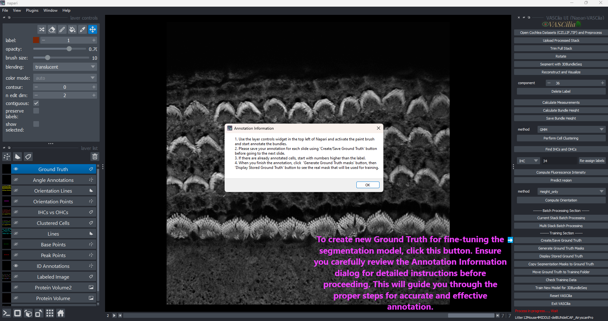
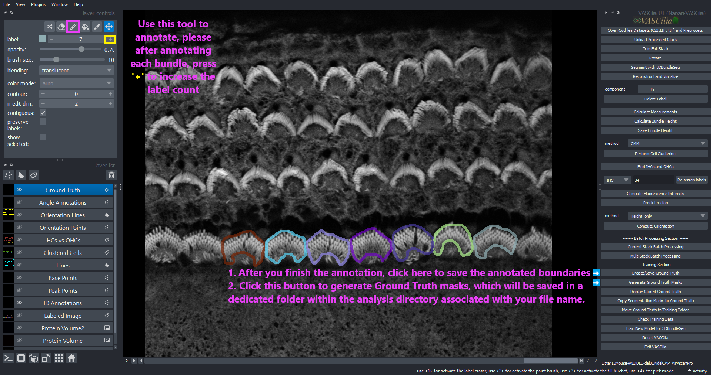
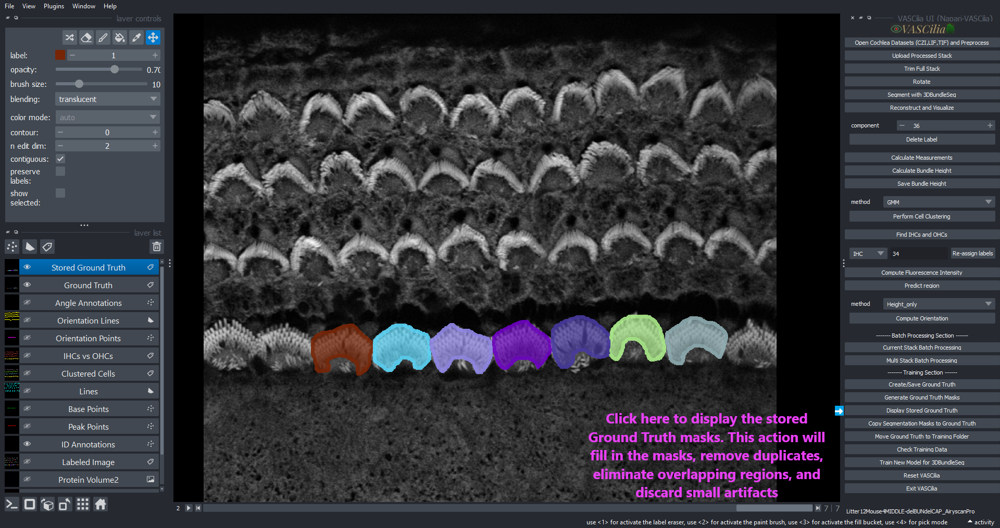
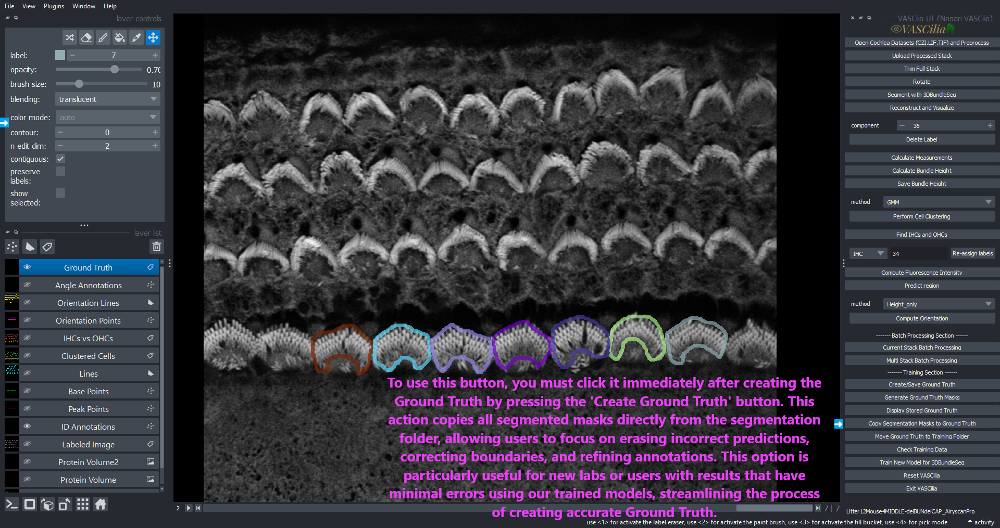
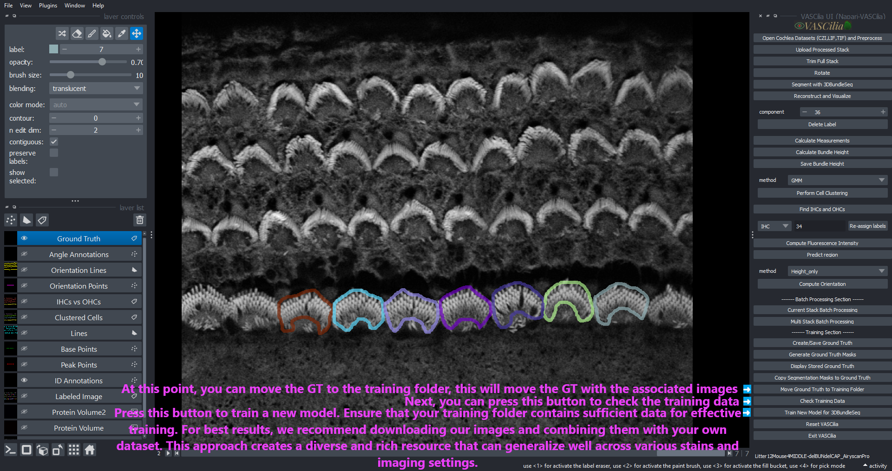

Commuting Training Action
=========================

This module provides a set of tools for generating, saving, validating, and training ground truth masks for cochlea stack analysis. These functionalities are part of the VASCilia plugin in Napari.

Features
--------

1. **Create Ground Truth (GT) Masks**:

   - Initiates the creation of ground truth annotations.
   - Enables users to paint and annotate regions using the Napari paintbrush tool.
   - Provides step-by-step instructions for annotating, saving, and generating masks.

2. **Save Ground Truth Masks**:

   - Processes annotations to:

     - Remove small components.
     - Fill holes in labeled regions.
     - Retain only the largest connected component for each label.
   - Saves the cleaned masks in a specified directory.

3. **Display Stored Ground Truth Masks**:

   - Displays previously saved ground truth masks as a 3D stack in Napari.
   - Ensures easy verification of stored annotations.

4. **Copy Ground Truth from Segmentation Results**:

   - Copies segmentation results into a new ground truth layer.
   - Allows users to refine pre-segmented masks for further analysis.

5. **Move Ground Truth Masks**:

   - Moves ground truth masks and their corresponding TIFF files to a user-specified directory.

6. **Validate Training Data**:

   - Checks the integrity of training and validation datasets:
     - Ensures matching numbers of TIFF and PNG files.
     - Validates file naming conventions.
     - Verifies that masks contain valid labels.
   - Ensures the selected training folder contains only `Train` and `Val` subdirectories.

7. **Train the Model**:

   - Trains a deep learning model using the prepared training dataset.
   - Utilizes a progress dialog to show real-time training progress.
   - Provides an estimated time for completion based on the number of iterations.

Error Handling
--------------

- **Annotation Errors**:

  - Ensure labels are within the range of 1 to 255.
  - Correct any invalid or empty labels in masks.

- **Validation Errors**:

  - Verify that the `Train` and `Val` folders contain equal numbers of TIFF and PNG files.
  - Ensure proper file naming conventions (`filename.tif` matches `filename.png`).

- **Training Errors**:

  - Ensure the output model folder is empty before starting training.
  - Validate the training dataset using **Check Training Data**.

File Management
---------------

- Ground truth masks are saved in: <rootfolder>/<filename_base>/Ground_Truth/

- Valid training and validation data are stored in separate `Train` and `Val` directories.

- Trained models are saved in the specified output model path in the config.json

Extending the Functionality
---------------------------
To add or modify functionality, edit the following files:

    - **commute_training_action.py**

---

---

---

---

---

